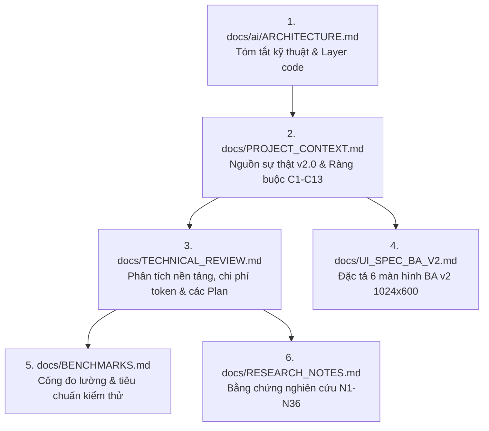

# 📚 Trung Tâm Tài Liệu & Kiến Trúc — Meeting Notes App (G720 AI Box)

> **Cập nhật:** v2.0 (02/10/2026).  
> **Mục tiêu:** Cung cấp bản đồ điều hướng toàn diện cho Lập trình viên và AI Agents khi tham gia phát triển dự án.

---

## 🧭 Thứ Tự Đọc Khuyến Nghị (Reading Order)

Để nắm bắt nhanh và chính xác nhất ngữ cảnh dự án (đặc biệt khi session AI mới bắt đầu), vui lòng đọc theo thứ tự:



1. **[`docs/ai/ARCHITECTURE.md`](file:///d:/DMHoang/Project_GitHub/NeuronPilot_Summary_App/docs/ai/ARCHITECTURE.md)**: Bản tóm tắt cô đọng nhất về các module, luồng dữ liệu, ràng buộc cứng và bẫy lỗi cần tránh.
2. **[`docs/PROJECT_CONTEXT.md`](file:///d:/DMHoang/Project_GitHub/NeuronPilot_Summary_App/docs/PROJECT_CONTEXT.md)**: **Single Source of Truth v2.0**. Chứa mục tiêu, phạm vi MVP/Phase 2, 13 ràng buộc cứng (C1–C13), 10 bất biến (I1–I10), 15 quyết định kỹ thuật (D1–D15) và 3 kế hoạch triển khai (Plan A, B, C).
3. **[`docs/TECHNICAL_REVIEW.md`](file:///d:/DMHoang/Project_GitHub/NeuronPilot_Summary_App/docs/TECHNICAL_REVIEW.md)**: Tài liệu chuyên sâu giải thích *vì sao* và *làm thế nào*: phân tích CPU/NPU, trần băng thông RAM, mô hình chi phí decode token, lý do loại bỏ việc sinh lại toàn văn, so sánh whisper.cpp / sherpa-onnx / MediaTek DLA.
4. **[`docs/UI_SPEC_BA_V2.md`](file:///d:/DMHoang/Project_GitHub/NeuronPilot_Summary_App/docs/UI_SPEC_BA_V2.md)**: Đặc tả chi tiết 6 màn hình chuẩn BA v2 tối ưu hóa cho màn hình cảm ứng ngang 10-inch 1024x600 trên Android 15.
5. **[`docs/BENCHMARKS.md`](file:///d:/DMHoang/Project_GitHub/NeuronPilot_Summary_App/docs/BENCHMARKS.md)**: Ma trận kiểm chứng các cổng chất lượng (Gate G0 đến G9, G-N1 đến G-N3, G-D).
6. **[`docs/RESEARCH_NOTES.md`](file:///d:/DMHoang/Project_GitHub/NeuronPilot_Summary_App/docs/RESEARCH_NOTES.md)**: Tổng hợp 36 dẫn chứng nghiên cứu thực tế (`[N1]` đến `[N36]`) từ tài liệu MediaTek Genio 720, LiteRT, papers PhoWhisper và các dự án Android on-device tương tự.

---

## 🗂️ Danh Mục Tài Liệu Chi Tiết

| Tên File | Phân Loại | Trạng Thái | Mô Tả Tóm Tắt |
|---|---|---|---|
| [`PROJECT_CONTEXT.md`](file:///d:/DMHoang/Project_GitHub/NeuronPilot_Summary_App/docs/PROJECT_CONTEXT.md) | Kiến trúc lõi | **Hiện hành (v2.0)** | Quy chuẩn cốt lõi: 13 ràng buộc C1-C13, 10 bất biến I1-I10, định nghĩa Plan B/C/A. |
| [`TECHNICAL_REVIEW.md`](file:///d:/DMHoang/Project_GitHub/NeuronPilot_Summary_App/docs/TECHNICAL_REVIEW.md) | Phân tích kỹ thuật | **Hiện hành (v2.0)** | Mô hình chi phí bộ nhớ & thời gian, đánh giá NPU vs CPU, chiến lược ASR & LLM. |
| [`BENCHMARKS.md`](file:///d:/DMHoang/Project_GitHub/NeuronPilot_Summary_App/docs/BENCHMARKS.md) | Đo lường / QA | **Hiện hành (v2.0)** | Tiêu chuẩn đo đạc các cổng Gate G0–G9 trên phần cứng G720 thực tế. |
| [`RESEARCH_NOTES.md`](file:///d:/DMHoang/Project_GitHub/NeuronPilot_Summary_App/docs/RESEARCH_NOTES.md) | Nghiên cứu nền tảng | **Hiện hành (v2.0)** | Dẫn nguồn bài báo khoa học, spec MediaTek, forum chính thức. |
| [`UI_SPEC_BA_V2.md`](file:///d:/DMHoang/Project_GitHub/NeuronPilot_Summary_App/docs/UI_SPEC_BA_V2.md) | Đặc tả Giao diện | **Hiện hành (v2.0)** | Layout 6 màn hình BA v2 (Danh sách, Ghi âm, Chọn đoạn, Pipeline, Kết quả, Cài đặt). |
| [`PHOWHISPER_BOS_STREAMING_ANALYSIS.md`](file:///d:/DMHoang/Project_GitHub/NeuronPilot_Summary_App/docs/PHOWHISPER_BOS_STREAMING_ANALYSIS.md) | Audio / STT | Hiện hành | Phân tích ngắt câu VAD, hàng đợi single-flight, loopback PhoWhisper server. |
| [`architecture/architecture_guide_v1.md`](file:///d:/DMHoang/Project_GitHub/NeuronPilot_Summary_App/docs/architecture/architecture_guide_v1.md) | Native / JNI | Tham chiếu gốc | Hướng dẫn tích hợp ban đầu của MediaTek NeuroPilot JNI Demo (SimpleModel, nn_sample). |
| [`architecture/architecture_guide_v2.md`](file:///d:/DMHoang/Project_GitHub/NeuronPilot_Summary_App/docs/architecture/architecture_guide_v2.md) | Native / JNI | Tham chiếu gốc | Cơ chế tích hợp thư viện native `libmtk_llm.so`, YAML config và luồng Streaming. |
| [`architecture/MODEL_PUSH_GUIDE.md`](file:///d:/DMHoang/Project_GitHub/NeuronPilot_Summary_App/docs/architecture/MODEL_PUSH_GUIDE.md) | Triển khai / Devops | Hiện hành | Hướng dẫn push model, file cấu hình và cấp quyền qua ADB vào thiết bị G720. |
| [`ai/ARCHITECTURE.md`](file:///d:/DMHoang/Project_GitHub/NeuronPilot_Summary_App/docs/ai/ARCHITECTURE.md) | AI Agent Index | **Hiện hành** | Tài liệu tra cứu tức thì cho AI agents về các tầng mã nguồn, data flow, bẫy lỗi. |

---

## 🗺️ Bản Đồ Ánh Xạ: Tài Liệu ↔ Mã Nguồn (Code Mapping)

Hệ thống mã nguồn trong dự án được tổ chức theo 2 phân hệ độc lập, giao tiếp thông qua Data Models và Bridges:

```
┌────────────────────────────────────────────────────────────────────────┐
│                      ỨNG DỤNG GHI CHÚ CUỘC HỌP                         │
│                  com.bhs.meetingnotes.* (Android 15)                   │
├───────────────────────────────────┬────────────────────────────────────┤
│ 1. UI & Presentation Layer        │ 2. Data & Persistence Layer        │
│    • MeetingNotesActivity.kt      │    • MeetingDatabase.kt (Room)     │
│    • MeetingRecordActivity.kt     │    • MeetingDao.kt, SegmentDao.kt  │
│    • MeetingSelectSegmentsActivity│    • MeetingEntity.kt              │
│    • MeetingProcessingActivity.kt │    • SegmentEntity.kt              │
│    • MeetingResultActivity.kt     │    • MeetingWithSegments.kt        │
│    • MeetingSettingsActivity.kt   │                                    │
├───────────────────────────────────┼────────────────────────────────────┤
│ 3. Audio Capture                  │ 4. Orchestration AI Pipeline       │
│    • I2SAudioRecorder.kt          │    • MeetingAiPipeline.kt          │
│    (16kHz/16-bit Mono,            │    (Tích hợp ASR -> Sửa lỗi regex  │
│     THREAD_PRIORITY_URGENT_AUDIO) │     -> Map-Reduce LLM -> DB)       │
└─────────────────┬─────────────────┴───────────────────┬────────────────┘
                  │                                     │
                  ▼                                     ▼
┌────────────────────────────────────────────────────────────────────────┐
│                   HẠ TẦNG NPU / NATIVE INFERENCE                       │
│    com.mediatek.neuropilot.jnidemo.*  &  app/src/main/cpp/*            │
├────────────────────────────────────────────────────────────────────────┤
│ • Native JNI: simple_model.cpp, nn_sample.cpp, CMakeLists.txt         │
│ • Runtimes: libmtk_llm.so (NeuroPilot LLM), libtokenizer.so            │
│ • Local ASR Daemon: WhisperServerClient.kt (127.0.0.1:8080 loopback)   │
│ • AI Bridges: NeuroPilotLlmBridge.kt, AudioCapture.kt, STTEngine.kt   │
│ 🛡️ BẤT BIẾN: Không sửa đổi cấu trúc native để tránh regression NPU!    │
└────────────────────────────────────────────────────────────────────────┘
```

---

## ⚡ Tra Cứu Mã Nguồn Bằng CodeGraph

Dự án đã được index toàn bộ mã nguồn bằng **CodeGraph AST Engine**. Thay vì quét toàn bộ file hoặc grep thủ công gây loãng context, AI và Lập trình viên có thể truy vấn nhanh qua terminal:

### 1. Trạng Thái Hiện Tại của CodeGraph
```bash
codegraph status
```
- **Files**: 154 files (C++, Kotlin, Java, XML, CMake)
- **Nodes**: 3,758 symbols (classes, methods, fields, functions)
- **Edges**: 6,131 relations (calls, overrides, imports)
- **Index Database**: `.codegraph/codegraph.db` (đã được cấu hình trong `.gitignore`)

### 2. Các Lệnh Tra Cứu Phổ Biến
| Mục Đích | Lệnh CLI | Ví Dụ |
|---|---|---|
| **Tìm định nghĩa symbol** | `codegraph query <symbol>` | `codegraph query MeetingAiPipeline` |
| **Tìm các nơi gọi đến** | `codegraph callers <method>` | `codegraph callers runPipeline` |
| **Tìm các hàm bị gọi bởi** | `codegraph callees <method>` | `codegraph callees startRecording` |
| **Đánh giá phạm vi ảnh hưởng** | `codegraph impact <symbol>` | `codegraph impact SegmentEntity` |
| **Đồng bộ sau khi sửa code** | `codegraph sync` | `codegraph sync` |

---

## ⚠️ Nguyên Tắc Bất Biến Dành Cho AI Agents

1. **Tuân thủ Gatekeeper Constraint**: Luôn đọc [`AGENTS.md`](file:///d:/DMHoang/Project_GitHub/NeuronPilot_Summary_App/AGENTS.md) và các skills liên quan trước khi thao tác code.
2. **Không tự ý sửa Native C++ / JNI**: Toàn bộ thư mục `app/src/main/cpp/*` và package `com.mediatek.neuropilot.jnidemo.aibox.*` là driver phần cứng đã được xác thực, cấm thay đổi khi thực hiện task UI/UX.
3. **Không sinh lại toàn văn bản**: Không dùng LLM viết lại toàn bộ 15.000 tokens transcript; tuân thủ cơ chế sửa lỗi bằng luật + alias và Map-Reduce JSON.
4. **Không phụ thuộc Internet**: Toàn bộ kiến trúc và pipeline phải hoạt động 100% offline (C1).
