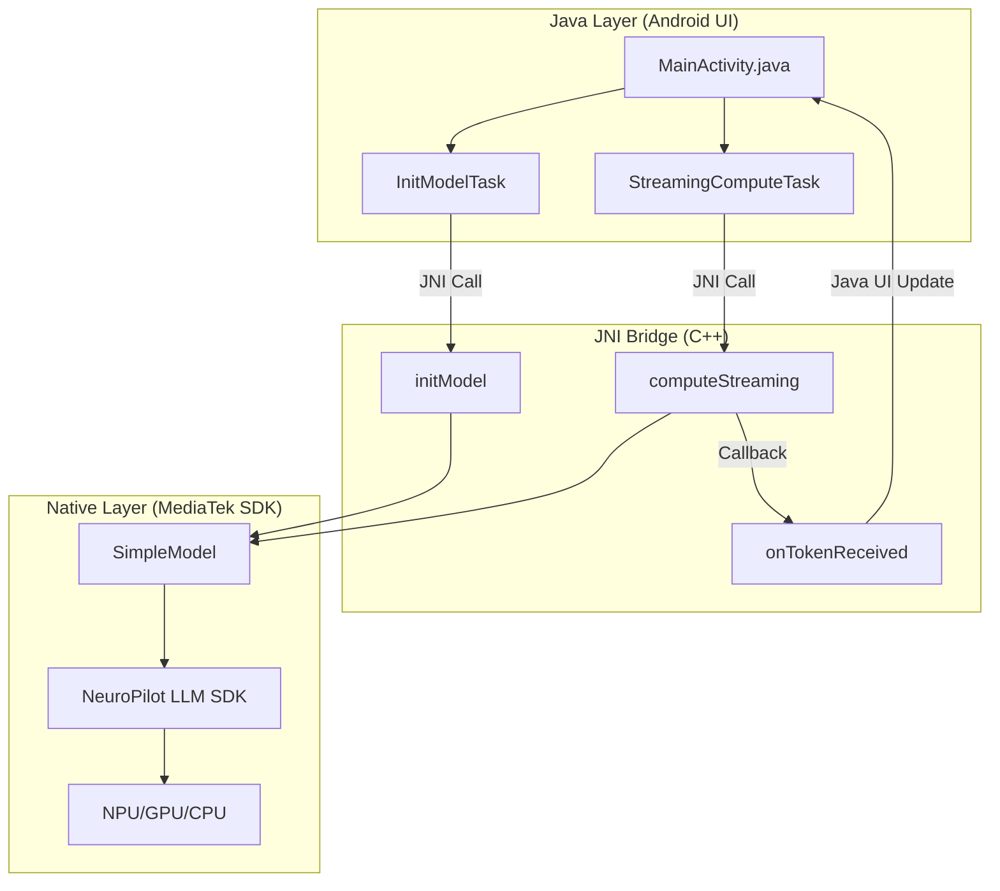
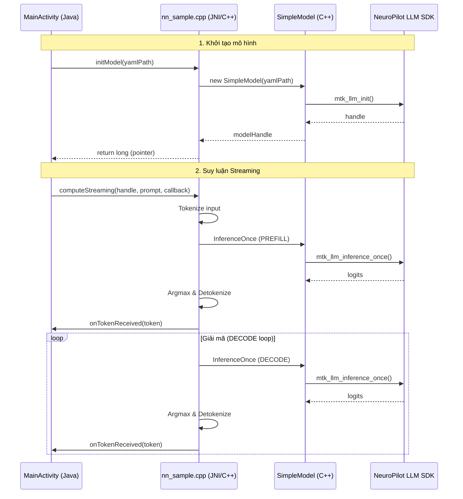

# Hướng dẫn Kiến trúc Chi tiết - NeuroPilot JNI Demo

Dự án này là một ví dụ minh họa cách tích hợp **MediaTek NeuroPilot LLM SDK** vào một ứng dụng Android thông qua **JNI (Java Native Interface)** để thực hiện suy luận (inference) mô hình ngôn ngữ lớn (LLM) trên thiết bị.

## 1. Tổng quan Kiến trúc

Kiến trúc của ứng dụng được chia thành 3 lớp chính:

### Các thành phần chính:
- **Java Layer**: Xử lý giao diện người dùng (UI), quản lý các tác vụ bất đồng bộ (AsyncTask) để tránh làm treo luồng chính (Main Thread).
- **JNI Bridge**: Đóng vai trò là cầu nối giữa Java và C++. Nó chuyển đổi dữ liệu (String, long) và gọi các hàm xử lý logic ở lớp Native.
- **Native Layer ([SimpleModel](file:///d:/FU/Android/G520_AI_SDK_MEDIATEK_TOOLS/NeuroPilotJniDemo_V%20_NoModel/app/src/main/cpp/simple_model.cpp#5-24))**: Lớp bao bọc (wrapper) cho NeuroPilot SDK. Nó quản lý vòng đời của mô hình và thực hiện các bước suy luận.

---

## 2. Luồng Xử lý (Sequence Diagram)

Luồng xử lý từ khi khởi tạo đến khi nhận được kết quả streaming:

---

## 3. Chi tiết các thành phần Native

### SimpleModel ([simple_model.cpp](file:///d:/FU/Android/G520_AI_SDK_MEDIATEK_TOOLS/NeuroPilotJniDemo_V%20_NoModel/app/src/main/cpp/simple_model.cpp))
Đây là lớp quan trọng nhất ở phía Native. Nó đóng vai trò là "Controller" cho NeuroPilot SDK:
- **`mtk_llm_init`**: Nạp mô hình dựa trên tệp cấu hình YAML.
- **`mtk_llm_inference_once`**: Thực hiện một bước suy luận. Nó hỗ trợ cả giai đoạn **Prefill** (xử lý prompt đầu vào) và **Decode** (sinh từng token tiếp theo).
- **`mtk_llm_reset`**: Xóa trạng thái KV Cache để chuẩn bị cho câu hỏi mới.

### JNI implementation ([nn_sample.cpp](file:///d:/FU/Android/G520_AI_SDK_MEDIATEK_TOOLS/NeuroPilotJniDemo_V%20_NoModel/app/src/main/cpp/nn_sample.cpp))
Chứa các hàm JNI được gọi từ Java:
- **[initModel](file:///d:/FU/Android/G520_AI_SDK_MEDIATEK_TOOLS/NeuroPilotJniDemo_V%20_NoModel/app/src/main/java/com/mediatek/neuropilot/jnidemo/MainActivity.java#37-39)**: Chuyển đổi đường dẫn YAML từ Java String sang C++ string và khởi tạo [SimpleModel](file:///d:/FU/Android/G520_AI_SDK_MEDIATEK_TOOLS/NeuroPilotJniDemo_V%20_NoModel/app/src/main/cpp/simple_model.cpp#5-24).
- **[computeStreaming](file:///d:/FU/Android/G520_AI_SDK_MEDIATEK_TOOLS/NeuroPilotJniDemo_V%20_NoModel/app/src/main/java/com/mediatek/neuropilot/jnidemo/MainActivity.java#40-41)**:
    1. **Pre-formatting**: Định dạng lại prompt đầu vào (ví dụ: Llama 3 format).
    2. **Tokenization**: Sử dụng `TiktokenTokenizer` để chuyển văn bản thành mảng các số (ids).
    3. **Prefill**: Chạy suy luận lần đầu với toàn bộ prompt.
    4. **Decode Loop**: Chạy lặp đi lặp lại để sinh ra từng token cho đến khi gặp token kết thúc (Stop Token) hoặc đạt giới hạn tối đa.

---

## 4. Cấu hình YAML và NeuroPilot

Tệp YAML (ví dụ: `config_llama3.2_1b_instruct.yaml`) định nghĩa các tham số quan trọng:
- **Model Path**: Đường dẫn đến tệp mô hình đã được nén (quantized) sang định dạng của MediaTek.
- **Runtime Options**: Lựa chọn bộ tăng tốc (NPU là ưu tiên số 1 để đạt hiệu năng cao nhất).
- **Tokenizer Path**: Đường dẫn đến tệp tokenizer (thường là `tokenizer.model` hoặc `vocab.json`).

## 5. Lưu ý về Hiệu năng
- **NPU Acceleration**: NeuroPilot LLM SDK tận dụng bộ xử lý AI (NPU) trên chipset MediaTek G520 để giảm tải cho CPU và tiết kiệm pin.
- **Quantization**: Mô hình thường được sử dụng ở định dạng 4-bit hoặc 8-bit để giảm dung lượng bộ nhớ và tăng tốc độ xử lý.
- **KV Caching**: SDK tự động quản lý KV Cache để tránh tính toán lại các token cũ trong quá trình sinh văn bản.

---

### Các tệp quan trọng cần tham khảo:
- [MainActivity.java](file:///d:/FU/Android/G520_AI_SDK_MEDIATEK_TOOLS/NeuroPilotJniDemo_V%20_NoModel/app/src/main/java/com/mediatek/neuropilot/jnidemo/MainActivity.java)
- [nn_sample.cpp](file:///d:/FU/Android/G520_AI_SDK_MEDIATEK_TOOLS/NeuroPilotJniDemo_V%20_NoModel/app/src/main/cpp/nn_sample.cpp)
- [simple_model.cpp](file:///d:/FU/Android/G520_AI_SDK_MEDIATEK_TOOLS/NeuroPilotJniDemo_V%20_NoModel/app/src/main/cpp/simple_model.cpp)
