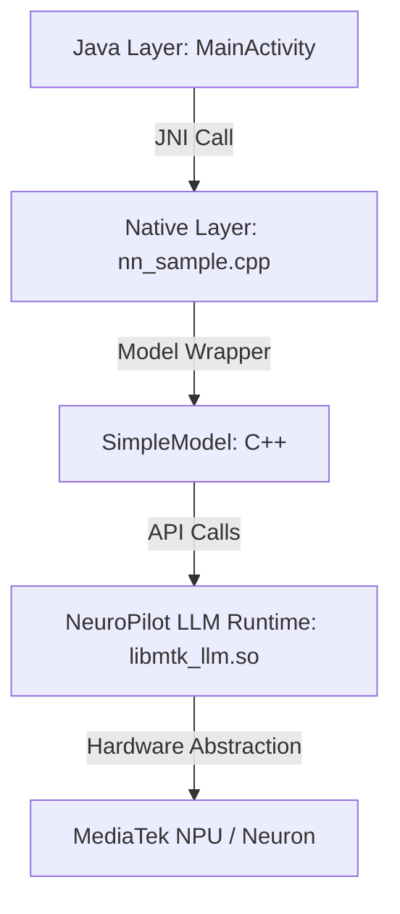

# Kiến trúc & Cơ chế Tích hợp Model (NeuroPilot)

Tài liệu này giải thích chi tiết cách ứng dụng tích hợp và vận hành mô hình ngôn ngữ lớn (LLM) trên thiết bị sử dụng SDK NeuroPilot của MediaTek.

## 1. Tổng quan Kiến trúc

Ứng dụng được chia thành 3 lớp chính:

### A. Lớp Java (Android App)
- **MainActivity.java**: Quản lý UI, nhận input từ người dùng và hiển thị kết quả.
- **ComputeTask (AsyncTask)**: Chạy việc suy luận (inference) ở background để không làm treo UI.
- **TokenCallback**: Interface để nhận từng token (từng chữ) từ lớp Native gửi về theo thời gian thực (Streaming).

### B. Lớp Native (JNI Bridge)
- **nn_sample.cpp**: Là "cây cầu" nối giữa Java và C++.
    1.  **Khởi tạo**: Tải cấu hình từ file `.yaml`, khởi tạo mô hình và bộ tách từ (Tokenizer).
    2.  **Tiền xử lý**: Định dạng input của người dùng theo template của Llama 3 (Prompt Template).
    3.  **Tokenization**: Chuyển văn bản thành một dãy số (tokens) mà máy tính hiểu được.
    4.  **Biên dịch ngược (Detokenization)**: Chuyển các số máy tính dự đoán được về lại thành chữ cái để gửi về Java.

### C. Lớp Model (NeuroPilot SDK)
- **SimpleModel.cpp**: Wrapper bao quanh SDK của MediaTek.
- **mtk_llm_init**: Khởi tạo runtime và nạp model vào bộ nhớ.
- **mtk_llm_inference_once**: Hàm cốt lõi để chạy mô hình. Nó nhận vào token và trả về xác suất của token tiếp theo (logits).

---

## 2. Luồng Xử lý Truy vấn (Query Flow)

Khi bạn nhấn nút "Search", quy trình sau sẽ diễn ra:

1.  **Formatting**: Câu hỏi "Hi" được biến đổi thành `<|begin_of_text|><|start_header_id|>user<|end_header_id|>Hi<|eot_id|>...`.
2.  **Prefill Phase**: Hệ thống xử lý toàn bộ đoạn mã prompt đầu vào cùng một lúc. Đây là giai đoạn chuẩn bị ngữ cảnh cho mô hình.
3.  **Decode Loop (Vòng lặp giải mã)**:
    -   Mô hình dự đoán 1 token tiếp theo.
    -   Token này được gửi ngay lập tức về Java để hiển thị lên màn hình (Streaming).
    -   Token đó lại được đưa ngược trở lại đầu vào của mô hình để dự đoán token kế tiếp.
    -   Vòng lặp tiếp tục cho đến khi gặp token kết thúc (`<|eot_id|>`) hoặc đạt giới hạn 256 chữ.

---

## 3. Cơ chế Tích hợp Chi tiết

### Tích hợp Thư viện
Trong file [CMakeLists.txt](file:///d:/FU/Android/G520_AI_SDK_MEDIATEK_TOOLS/NeuroPilotJniDemo_V%20_NoModel/app/src/main/cpp/CMakeLists.txt), dự án liên kết với các thư viện quan trọng của MediaTek:
- `libmtk_llm.so`: Thư viện Runtime chính cho LLM.
- `libtokenizer.so`: Xử lý việc chuyển đổi chữ <-> số.
- `libcommon.so`: Các tiện ích chung của NeuroPilot.
- `libyaml-cpp.so`: Dùng để đọc file cấu hình mô hình.

### Tối ưu hóa Phần cứng
Mô hình không chạy trên CPU thông thường mà chạy trên **NPU (Neural Processing Unit)** thông qua **Neuron Runtime**.
- Mô hình thường được lưu dưới dạng đã nén (quantized) để giảm dung lượng và tăng tốc độ chạy trên thiết bị di động.
- NeuroPilot SDK giúp tự động phân bổ khối lượng tính toán sao cho hiệu quả nhất trên chip G520.

### Cấu hình (YAML)
File `.yaml` đóng vai trò cực kỳ quan trọng, nó chứa:
- Đường dẫn file model (`.tflite` hoặc `.dla`).
- Đường dẫn file Tokenizer.
- Các tham số kỹ thuật như `top_k`, `temperature` (độ sáng tạo của AI) và các ID của các token đặc biệt.
